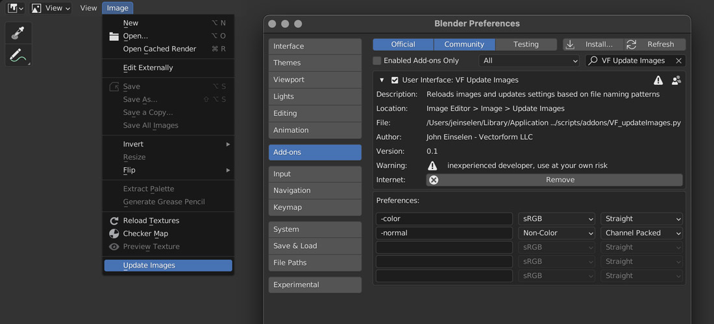
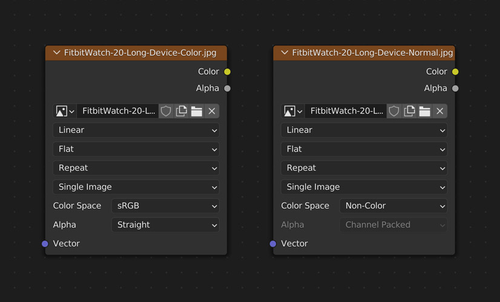

# VF Update Images

Reloads images from disk and updates color space + alpha mode settings based on file naming patterns.

Only images without unsaved changes made in Blender will be reloaded, and the pattern matching is case-insensitive for a little more leniency.

## Installation and Usage
- Download [VF_updateImages.py](https://raw.githubusercontent.com/jeinselenVF/VF-BlenderUpdateImages/main/VF_updateImages.py)
- Open Blender Preferences and navigate to the "Add-ons" tab
- Install and enable the Add-on
- Customise the filter patterns and settings as needed
- It will show up as `Update Images` in the `Image` menu of all `Image Editor` views

## Settings

Up to five unique name patterns can be used with the following settings each.

- `Filter Name` defines the pattern to look for in the file name
- `Color Space` will set any files that match the pattern to the selected color space
	- `Filmic Log`
	- `Linear`
	- `Linear ACES`
	- `Linear ACEScg`
	- `Non-Color` typically used for normal maps
	- `Raw`
	- `sRGB` common format used by image editors (Blender default)
	- `XYZ`
- `Alpha Mode`
	- `Straight` RGB channels are stored without association, but the alpha channel still operates as a mask (Blender default)
	- `Premultiplied` RGB channels have been multiplied by the alpha channel as an embedded mask
	- `Channel Packed` Treat the alpha as a fourth color channel without masking
	- `None` Ignore alpha channel

When new images are imported, running the `Update Images` command will change the settings of all matching files.

## Notes

- Add-on should not reload images that have unsaved changes made in Blender (thereby losing those changes), but no warranty is provided. Use at your own risk.