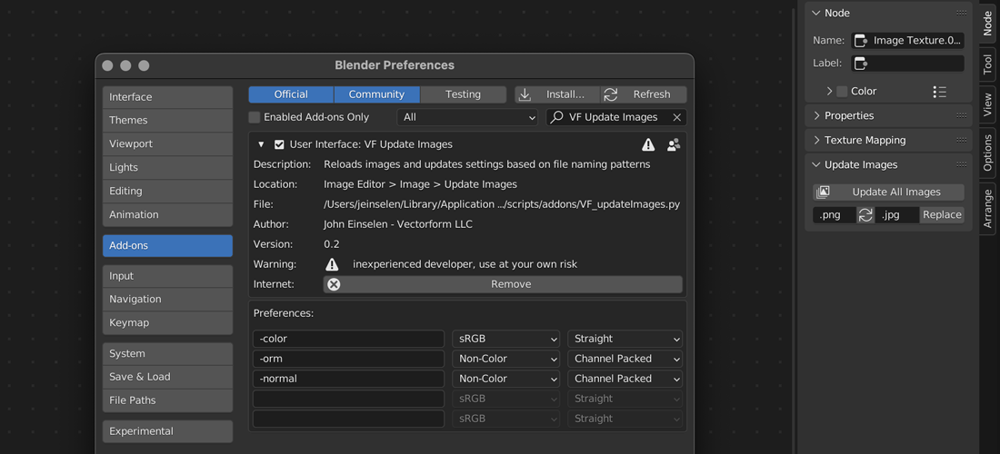
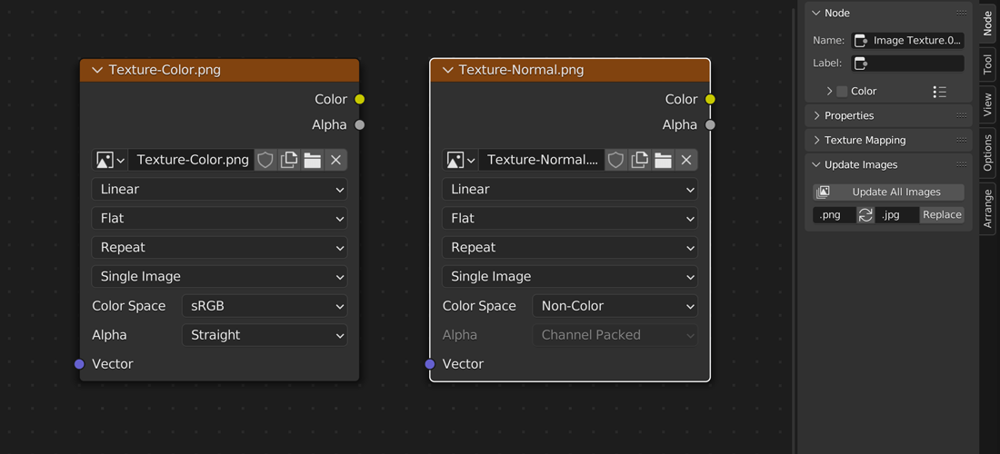

# VF Update Images

This add-on was designed for Blender version 2.8-4.1 (though not all previous versions may be fully supported). For Blender 4.2 and onwards, [please see the new Production Kit extension](https://github.com/jeinselen/Blender-ProductionKit).

Reloads images from disk and updates color space + alpha mode settings based on file naming patterns.

Only images without unsaved changes made in Blender will be reloaded, and the pattern matching is case-insensitive for a little more leniency.

## Installation and Usage
- Download [VF_updateImages.py](https://raw.githubusercontent.com/jeinselenVF/VF-BlenderUpdateImages/main/VF_updateImages.py)
- Open Blender Preferences and navigate to the "Add-ons" tab
- Install and enable the Add-on
- Customise the filter patterns and settings as needed
- It will show up as `Update Images` in the `Image` menu of all `Image Editor` views

## Settings

Up to five unique name patterns can be used with the following settings each.

- `Filter Name` defines the pattern to look for in the file name
- `Color Space` will set any files that match the pattern to the selected color space
	- `Filmic Log`
	- `Linear`
	- `Linear ACES`
	- `Linear ACEScg`
	- `Non-Color` typically used for normal maps
	- `Raw`
	- `sRGB` common format used by image editors (Blender default)
	- `XYZ`
- `Alpha Mode`
	- `Straight` RGB channels are stored without association, but the alpha channel still operates as a mask (Blender default)
	- `Premultiplied` RGB channels have been multiplied by the alpha channel as an embedded mask
	- `Channel Packed` Treat the alpha as a fourth color channel without masking
	- `None` Ignore alpha channel

When new images are imported, clicking on `Update Images` in the Node panel will change the settings of all matching files.

File name pattern replacement can also be run from the Node panel. The default settings are designed for switching between .png and .jpg source files. For example, using .png texture sources for rendering, and switching to .jpg sources for exporting compressed GLB files. But the text fields can be literally anything, and after updating input file names, all files will be reloaded (no verification is performed, it's assumed that the file names being updated exist in the file system).

## Notes

- Add-on should intelligently skip reloading images that have unsaved changes made in Blender (which would lose those changes), but no warranty is provided
- Use at your own risk